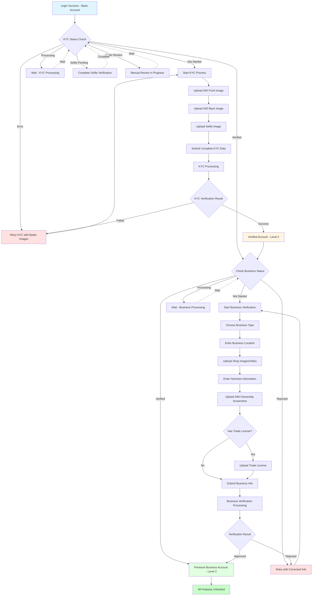

# sManager Account Verification Guide

## Overview
This guide explains how to verify your sManager merchant account. By completing the verification steps, you'll unlock more features and higher transaction limits in your sManager app. The process takes you from a basic account to a fully verified business account with access to all premium features.

## Table of Contents
- [Understanding Account Types](#understanding-account-types)
- [Verification Journey Overview](#verification-journey-overview)
- [What You'll Need](#what-youll-need)
- [Step 1: Personal Verification (KYC)](#step-1-personal-verification-kyc)
- [Step 2: Business Verification](#step-2-business-verification)
- [Business Information Guide](#business-information-guide)
- [Common Questions](#common-questions)
- [Tips for Success](#tips-for-success)
- [Need Help?](#need-help)

---

## Understanding Account Types

Your sManager account has three levels. As you complete verification, you unlock more features:

| Level | Account Type | What's Completed | What You Get |
|-------|--------------|------------------|--------------|
| **Level 1** | Basic Account | Just registered | Basic features, limited transactions |
| **Level 2** | Verified Account | Personal verification (KYC) done | More features, higher transaction limits |
| **Level 3** | Premium Business Account | Personal + Business verification done | All features, maximum transaction limits, priority support |

### Why Verify Your Account?

**Level 1 → Level 2 Benefits:**
- 📈 Higher daily transaction limits
- 💰 Access to more payment methods
- 🔒 Enhanced account security
- ⚡ Faster payment processing

**Level 2 → Level 3 Benefits:**
- 🚀 All features unlocked
- 💎 Maximum transaction limits
- 👥 Staff management capabilities
- 📊 Advanced business reports
- 🎯 Priority customer support
- 🏪 Online store features

---

## Verification Journey Overview

---

## What You'll Need

Before you start, make sure you have:

### For Personal Verification (KYC):
- 📱 Your smartphone with camera
- 🆔 National ID Card (NID) - both sides
- 🤳 A well-lit space for taking your selfie
- ⏰ 5-10 minutes of your time

### For Business Verification:
- 🏪 Photos of your business/shop (if you have a physical location)
- 📱 SIM ownership proof (we'll show you how to get this)
- 📄 Trade License (optional, but helps with faster approval)
- 👤 Nominee information (a trusted person's details)
- 🏠 Your business address details
- ⏰ 10-15 minutes of your time

---

## Step 1: Personal Verification (KYC)

### What is KYC?

KYC stands for "Know Your Customer." It's a simple process where you verify your identity using your National ID Card and a selfie. This helps keep your account secure and unlocks better features.

**Why do we need this?**
- Protects your account from fraud
- Required by Bangladesh Bank regulations
- Unlocks higher transaction limits
- Gives you access to more features

---

### Understanding Your Verification Status

Your sManager app will show one of these statuses:

| Status | What it Means | What to Do |
|--------|---------------|------------|
| ⏳ **Not Started** | You haven't begun verification yet | Start the KYC process |
| ✅ **Verified** | Your identity is confirmed! | Move on to Business Verification |
| 🔄 **Processing** | We're reviewing your documents | Wait 1-2 business days |
| ❌ **Needs Attention** | Something needs to be fixed | Check the app for details and resubmit |
| 📸 **Selfie Pending** | We need a clearer selfie photo | Take a new selfie |
| 👁️ **Under Review** | Our team is checking manually | Wait for notification |

---

### How to Complete KYC

Follow these simple steps in your sManager app:

#### Step 1: Take a Photo of Your NID (Front Side)

📸 **Tips for a great photo:**
- Make sure all text is clear and readable
- No glare or shadows on the card
- Take the photo on a plain, dark background
- Keep your phone steady - no blurry images
- Make sure all four corners of the card are visible

**Common mistakes to avoid:**
- ❌ Photo is too dark or too bright
- ❌ Card is cut off at the edges
- ❌ Flash creates glare on the card
- ❌ Photo is taken at an angle

---

#### Step 2: Take a Photo of Your NID (Back Side)

📸 **Follow the same tips as Step 1:**
- Clear, well-lit photo
- No glare or reflections
- All text should be readable
- Plain background
- All corners visible

---

#### Step 3: Take a Selfie

🤳 **How to take a good selfie:**
- Face the camera directly
- Make sure your face is well-lit (natural light is best)
- Remove sunglasses or hat
- Keep a neutral expression
- Make sure your whole face is visible
- Don't use filters or effects

**Why we need this:**
Your selfie helps us confirm that you are the same person shown on your NID card.

---

#### Step 4: Fill in Your Information

You'll need to enter:
- **Full Name** (exactly as shown on your NID)
- **NID Number** (10 or 13 digits from your card)
- **Date of Birth** (as shown on your NID)
- **Gender** (Male/Female)

**Important:** Make sure all information matches your NID exactly. Any mismatch will cause rejection.

---

#### Step 5: Submit for Verification

After you submit:
1. You'll see a confirmation message
2. We'll send you a notification
3. Processing usually takes **1-2 business days**
4. You can check your status anytime in the app

---

### What Happens After Submission

**During Processing (1-2 business days):**
- Our system automatically checks your NID information
- We verify your selfie matches your NID photo
- We confirm your details with official records

**You'll receive a notification when:**
- ✅ Your verification is approved
- ❌ We need you to resubmit (with clear instructions on what to fix)

**Can I use sManager while waiting?**
Yes! You can continue using basic features while your verification is being processed.

---

### If Your KYC is Rejected

Don't worry! This is common and easy to fix. Here's why KYC might be rejected:

| Problem | Solution |
|---------|----------|
| 📸 Photos are blurry | Retake photos in better lighting, keep phone steady |
| 🌞 Too much glare on NID | Avoid using flash, take photo in natural light |
| 😊 Selfie doesn't match NID | Make sure you're not wearing glasses/hat, face camera directly |
| ℹ️ Information doesn't match | Double-check your NID number, name, and date of birth |
| 🔢 NID already used | This NID is linked to another account - contact support |

**How to resubmit:**
1. Open sManager app
2. Go to Profile or Verification section
3. Follow the prompts to submit new photos/information
4. Make sure to fix the issues mentioned in the rejection notice

---

## Step 2: Business Verification

### What is Business Verification?

Once your personal identity is verified (KYC complete), you can verify your business information. This unlocks all premium features and maximum transaction limits.

**Benefits of completing Business Verification:**
- 🚀 Access to all sManager features
- 💰 Higher transaction limits (up to 10 lakh BDT daily)
- 👥 Add staff members to your account
- 🏪 Create your online store
- 📊 Advanced business reports
- 🎯 Priority customer support

---

### Understanding Your Business Status

| Status | What it Means | What to Do |
|--------|---------------|------------|
| ⏳ **Not Started** | You haven't provided business info yet | Complete KYC first, then start |
| 🔄 **Processing** | We're reviewing your business details | Wait 2-4 business days |
| ✅ **Verified** | You're a Premium Business Account! | Enjoy all features |
| ❌ **Rejected** | We need better information | Check details and resubmit |

---

### How to Complete Business Verification

#### Step 1: Choose Your Business Type

Select the option that best describes your business:

| Type | Best For | Examples |
|------|----------|----------|
| 🌐 **Online Business** | Digital/E-commerce businesses | Facebook shop, website store, online services |
| 🏪 **Offline Business** | Physical stores | Retail shop, restaurant, salon, grocery |
| 🔄 **Both** | Hybrid businesses | Shop with online delivery, restaurant with online orders |

---

#### Step 2: Provide Business Location

You'll need to select:
- **Division** (e.g., Dhaka, Chittagong)
- **District** (e.g., Dhaka, Gazipur)
- **Thana** (e.g., Gulshan, Banani)
- **Full Address** (your business location)

**Can I use my home address?**
Yes! If you run your business from home, that's perfectly fine.

---

#### Step 3: Upload Business Photos/Videos

**For Physical Stores (Offline/Both):**

📸 **Shop Photo Requirements:**
- Clear photo showing your business storefront or workspace
- Make sure your business name/signboard is visible (if you have one)
- Good lighting - natural daylight is best
- Should clearly show it's a real business location

🎥 **Shop Video (Optional but Recommended):**
- Short video (10-60 seconds) of your business
- Walk around and show the main areas
- This helps us verify faster!

**For Online Businesses:**
- If you have social media business pages (Facebook, Instagram), note down the links
- You can provide your website URL if you have one

---

#### Step 4: Provide Nominee Information

A nominee is a trusted person you choose to be associated with your account.

**Who can be your nominee?**
- Family member (father, mother, spouse, sibling, child)
- Close friend
- Business partner

**Information you'll need:**
- Nominee's full name
- Relationship to you (father, mother, brother, sister, spouse, etc.)
- Nominee's date of birth

**Why we need a nominee:**
This is an additional security measure required by regulations.

---

#### Step 5: Upload SIM Ownership Proof

This proves that the mobile number you're using actually belongs to you.

**How to get your SIM ownership screenshot:**

1. **Dial this code from your registered number:**
   - For most operators: `*16001#`
   - Follow the on-screen prompts

2. **You'll see a screen showing:**
   - Your name
   - Your NID number
   - SIM registration details

3. **Take a screenshot** (must be clear and readable)

4. **Upload the screenshot in the app**

**Important:** The name and NID should match your KYC information.

---

#### Step 6: Upload Trade License (Optional)

**Do I need a Trade License?**
No, it's optional! But having one helps:
- ✅ Faster approval process
- ✅ Shows your business is registered
- ✅ May help with higher limits

**If you have a Trade License:**
- Take a clear photo of the license
- Make sure all text is readable
- License should be valid (not expired)
- Upload it in the app

**If you don't have a Trade License:**
- You can still complete verification
- It might take a bit longer to process
- You can always add it later

---

#### Step 7: Review and Submit

Before submitting, double-check:
- ✅ All photos are clear and readable
- ✅ Business information is accurate
- ✅ Nominee details are correct
- ✅ Address matches your actual business location
- ✅ SIM ownership screenshot is clear

Then hit **Submit**!

---

### What Happens After Submission

**During Processing (2-4 business days):**
- Our team reviews your business information
- We verify your photos and documents
- We may contact you if we need clarification

**You'll receive a notification when:**
- ✅ Your business is verified - congratulations!
- ❌ We need additional information or clearer photos

**Can I use sManager while waiting?**
Yes! All your Level 2 features remain active. Once approved, you'll automatically get access to premium features.

---

### If Your Business Verification is Rejected

This is usually easy to fix! Common reasons and solutions:

| Problem | Solution |
|---------|----------|
| 📸 Shop photo is unclear | Take a new photo in better lighting, show more of your business |
| 🏪 Can't verify business location | Make sure photo clearly shows your shop/workspace |
| 📱 SIM ownership screenshot unclear | Retake screenshot, zoom in if needed, avoid glare |
| 📄 Trade license is expired | Update with current valid license or submit without it |
| ℹ️ Information incomplete | Fill in all required fields, check for missing details |
| 👤 Nominee information mismatch | Verify nominee's name and date of birth |

**How to resubmit:**
1. You'll get a notification explaining what needs to be fixed
2. Go to your Profile or Verification section in the app
3. Update the required information or photos
4. Submit again

Most resubmissions are approved within 1-2 business days!

---

## Business Information Guide

### Choosing the Right Business Type

| Business Type | Choose This If... | Examples |
|---------------|-------------------|----------|
| 🌐 **Online Only** | You only sell/provide services online, no physical store | Facebook shop owner, freelancer, digital service provider, online tutor |
| 🏪 **Offline Only** | You have a physical location, no online sales | Grocery store, salon, restaurant, pharmacy, repair shop |
| 🔄 **Both Online & Offline** | You have a store AND sell online | Shop owner who also does Facebook sales, restaurant with delivery app |

**Not sure which to choose?**
- If you work from home and sell on social media → Choose **Online**
- If customers visit your shop/location → Choose **Offline**
- If you do both → Choose **Both**

---

### Nominee Relationship Options

Choose the relationship that best describes your nominee:

- মা (Mother)
- বাবা (Father)
- ভাই (Brother)
- বোন (Sister)
- স্বামী (Husband)
- স্ত্রী (Wife)
- ছেলে (Son)
- মেয়ে (Daughter)
- বন্ধু (Friend)
- সহকর্মী (Colleague/Co-worker)

---

### Photo & Document Guidelines

**✅ Good Photos:**
- Taken in good natural lighting (daytime is best)
- All text is clear and readable
- No shadows or glare
- Straight angle (not tilted)
- All corners visible
- Plain background

**❌ Avoid:**
- Using flash (creates glare)
- Taking photos at night (too dark)
- Blurry or shaky photos
- Photos taken at an angle
- Screenshots of other photos
- Edited or filtered images

**File Size Limits:**
- Photos: Maximum 5 MB each
- Videos: Maximum 50 MB
- Formats: JPG, PNG for photos; MP4 for videos

---

## Common Questions

### About Personal Verification (KYC)

**Q: How long does KYC verification take?**  
A: Usually 1-2 business days. You'll get a notification when it's done.

**Q: Can I use a Smart NID or old NID?**  
A: Both work! Just make sure the photo is clear.

**Q: What if my NID photo is very old?**  
A: That's okay! Just make sure your selfie is clear and shows your face properly.

**Q: I made a mistake in my information. Can I edit it?**  
A: Before submitting - yes! After submitting - no, but you can resubmit with correct information if rejected.

**Q: Is my information safe?**  
A: Absolutely! We use bank-level security. Your data is encrypted and never shared with third parties.

---

### About Business Verification

**Q: I don't have a shop. Can I still get verified?**  
A: Yes! If you run an online business from home, choose "Online Business" and you can use your home as the business address.

**Q: Do I need a Trade License?**  
A: No, it's optional. Many successful merchants don't have one. It just helps speed up approval.

**Q: What if I work from a shared space or someone else's shop?**  
A: That's fine! Take a photo of where you actually work and mention it in your application.

**Q: Can I change my business type later?**  
A: Yes, you can update your business information through the app settings.

**Q: I don't have a website. Is that a problem?**  
A: Not at all! If you sell on Facebook or WhatsApp, that counts as online business. You can mention your social media pages.

---

### About SIM Ownership

**Q: What if *16001# doesn't work on my number?**  
A: Try these alternatives:
- For Grameenphone: Dial *121*5#
- For Robi/Airtel: Dial *140#
- For Banglalink: Dial *1212#
- Check with your operator's customer service

**Q: The screenshot is too small to read. What should I do?**  
A: After taking the screenshot, you can zoom in when uploading to make sure all text is visible.

---

### About Processing Time

**Q: Why is my verification taking longer than expected?**  
A: Sometimes we need to verify information manually, which takes extra time. Common reasons:
- High volume of applications
- Holidays or weekends
- Need additional verification steps
- Photo quality issues requiring human review

**Q: Can I contact someone to speed up my verification?**  
A: Our team works as fast as possible! You can contact support if it's been more than:
- 3 business days for KYC
- 5 business days for Business Verification

---

### About Rejection

**Q: I was rejected. Does that mean I can never get verified?**  
A: Not at all! Most people who get rejected are approved on their second try. Just fix the issues mentioned and resubmit.

**Q: How many times can I resubmit?**  
A: There's no limit! Take your time to get good photos and correct information.

**Q: Will rejection affect my account?**  
A: No, you can continue using your current account level normally.

---

## Tips for Success

### 📸 Photo Tips

**For NID Photos:**
1. Clean your NID card first (no dust or fingerprints)
2. Place it on a dark, plain surface (dark table or black paper)
3. Make sure all four corners are in the frame
4. Use natural daylight (near a window is perfect)
5. Don't use flash
6. Hold your phone steady or use a flat surface

**For Selfies:**
1. Face a window for best natural lighting
2. Remove glasses, hats, or masks
3. Keep a neutral expression (no big smile needed)
4. Make sure your face fills most of the frame
5. Look directly at the camera
6. Take multiple photos and choose the clearest one

**For Shop Photos:**
1. Take photos during daytime
2. Show the entrance and main signboard
3. Include surrounding landmarks if possible
4. Take from a slight distance to show context
5. If indoors, turn on all lights

---

### ✅ Information Entry Tips

1. **Double-check everything** before submitting
2. **Match NID exactly** - same spelling, same format
3. **Use English** for your name (as shown on NID)
4. **Date format** should be DD-MM-YYYY
5. **NID number** - enter all digits, no spaces
6. **Mobile number** - must match your SIM ownership proof

---

### ⏰ Timing Tips

**Best time to submit:**
- **Early in the week** (Monday-Tuesday) - Faster processing
- **Avoid weekends** - Submissions made Friday evening will wait until Monday
- **Avoid public holidays** - Processing stops during holidays

**After submission:**
- Don't submit multiple times - it doesn't speed things up!
- Check your app once daily for updates
- Keep notifications turned on
- Respond quickly if we request additional information

---

### 🎯 Final Checklist

Before clicking "Submit," make sure:

**For KYC:**
- [ ] NID front photo is clear and readable
- [ ] NID back photo is clear and readable  
- [ ] Selfie clearly shows your face
- [ ] Name exactly matches your NID
- [ ] NID number is correct (10 or 13 digits)
- [ ] Date of birth matches your NID
- [ ] All information double-checked

**For Business Verification:**
- [ ] Business type selected correctly
- [ ] Address details are complete and accurate
- [ ] Shop photos/videos are clear (if applicable)
- [ ] SIM ownership screenshot is readable
- [ ] Nominee information is correct
- [ ] Trade license photo is clear (if providing)
- [ ] All required fields are filled

---

## Need Help?

**If you're stuck or need assistance:**

📱 **In-App Support**
- Open sManager app
- Go to Settings → Help & Support
- Chat with our support team

📧 **Email Support**
- Send your query to: support@shebapay.xyz
- Include your registered mobile number
- Describe your issue clearly

⏰ **Support Hours**
- Saturday to Thursday: 9 AM - 6 PM
- Friday: Closed
- Response time: Usually within 24 hours

**Common support requests:**
- "My verification is taking too long"
- "I can't upload my photo"
- "I need help with SIM ownership proof"
- "My verification was rejected and I don't understand why"

Our team is here to help you succeed!## Your Verification Journey Summary

### 🎯 Complete These Steps to Unlock Everything:

**Step 1: Personal Verification (KYC)**
→ Upload NID + Selfie  
→ Wait 1-2 business days  
→ ✅ Level 2 Unlocked!

**Step 2: Business Verification**  
→ Provide business info + photos  
→ Wait 2-4 business days  
→ ✅ Level 3 Unlocked - Full Access!

### 💡 Remember:
- Take clear, well-lit photos
- Double-check all information
- Be patient during processing
- Resubmit if needed - no penalties!
- Contact support if you need help

**You're building a verified, trusted business account that will help you grow. We're here to support you every step of the way!** 🚀

---

**Document Version:** 1.0  
**Last Updated:** January 12, 2026  
**Support:** support@shebapay.xyz | In-app chat available  
